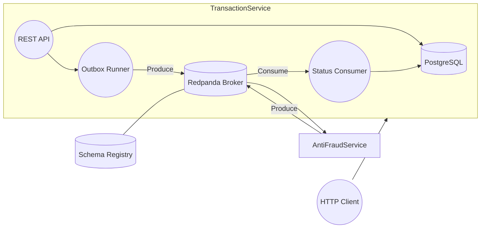

# Yape Code Challenge – Event-driven Transactions Platform

This repository implements the reference solution for the Yape challenge: a pair of NestJS microservices orchestrated through Redpanda (Kafka API) and backed by PostgreSQL. The system persists transactions, emits `transactions.created` events through an Outbox pattern, and updates their status based on anti-fraud decisions.

---

## Table of contents
1. [Architecture overview](#architecture-overview)
2. [Local development](#local-development)
   - [Prerequisites](#prerequisites)
   - [Bootstrapping with Docker Compose](#bootstrapping-with-docker-compose)
   - [Manual service runs](#manual-service-runs)
3. [Testing](#testing)
4. [API & messaging contracts](#api--messaging-contracts)
5. [Design notes](#design-notes)

---

## Architecture overview

- **transaction-service** (NestJS + Prisma + PostgreSQL)
  - REST interface (`POST /transactions`, `GET /transactions/:id`)
  - Hexagonal architecture (application services, ports, adapters)
  - Outbox pattern with advisory locking and exponential backoff
  - Produces `transactions.created` events via Redpanda + Avro + Schema Registry
  - Consumes `transactions.status.changed` to update DB records

- **anti-fraud-service** (NestJS worker)
  - Consumes `transactions.created`
  - Rejects transactions whose `value > 1000`, else approves
  - Emits `transactions.status.changed` events with audit metadata

Support services run through Docker Compose:



---

## Local development

### Prerequisites
- Docker Desktop (or compatible runtime)
- Node.js 20+
- npm 9+

### Bootstrapping with Docker Compose

The compose file provisions Postgres, Redpanda, Schema Registry, and both NestJS services. Migrations are executed automatically on service start and the Avro/OpenAPI contracts are copied into each runtime image at `/usr/src/contracts`.

```bash
# from repo root
docker compose build --no-cache   # ensures prisma client + contracts are regenerated
docker compose up                 # starts the full stack in the foreground

# (optional) run detached
docker compose up -d
```

When the services are healthy you can exercise the flow end-to-end from inside the `transaction-service` container (useful on Windows shells that struggle with quoting):

```bash
docker compose exec transaction-service node -e "const fetch=require('node-fetch');fetch('http://127.0.0.1:3000/transactions',{method:'POST',headers:{'Content-Type':'application/json'},body:JSON.stringify({accountExternalIdDebit:'11111111-1111-1111-1111-111111111111',accountExternalIdCredit:'22222222-2222-2222-2222-222222222222',tranferTypeId:1,value:250,transactionExternalId:'aaaaaaaa-bbbb-cccc-dddd-eeeeeeeeeeee'}})}).then(async res=>{console.log(res.status,res.statusText);const text=await res.text();console.log(text);process.exit(0);}).catch(err=>{console.error(err);process.exit(1);});"

# Verify the anti-fraud worker published the status change
docker compose logs anti-fraud-service --since=1m
```

Swagger UI remains available at [http://localhost:3000/docs](http://localhost:3000/docs).

### Manual service runs

Each service can be run locally against the Dockerized infrastructure:

```bash
# install deps
cd transaction-service && npm install
cd ../anti-fraud-service && npm install

# start infra only
docker compose up -d postgres redpanda schema-registry

# run services locally (two terminals)
cd transaction-service && npm run start:dev
cd anti-fraud-service && npm run start:dev
```

Environment variables are defined in the compose file and loaded via Nest Config.

---

## Testing

Both services ship with Jest configurations.

```bash
# transaction service
cd transaction-service
npm test          # unit + integration specs
npm run test:cov  # coverage report

# anti-fraud service
cd ../anti-fraud-service
npm test
```

Key coverage highlights:
- Domain helpers and anti-fraud decision rule
- Application services (create transaction, status updates, anti-fraud handler)
- Persistence adapters (Prisma transaction repo)
- Messaging adapters (Kafka producer, status consumer)
- E2E spec for REST API exercising create/retrieve + outbox enqueue

---

## API & messaging contracts
- OpenAPI spec: `contracts/openapi/transactions.yaml`
- Avro schemas: `contracts/avro/*.avsc`
  - `yape.transactions.TransactionCreated.avsc`
  - `yape.transactions.TransactionStatusChanged.avsc`

Use these contracts for client generation or broker validation.

---

## Design notes

1. **Hexagonal architecture** – ports define interfaces for repositories, publishers, and use cases; adapters wire Prisma, Kafka, and HTTP controllers.
2. **Outbox pattern** – transactional write of business entity + outbox row ensures reliable messaging. A dedicated scheduler publishes in batches with exponential backoff and advisory locks for concurrency.
3. **Event-driven anti-fraud** – decisions are pure functions, enabling deterministic unit tests. Anti-fraud workers emit status change events consumed by the transaction service.
4. **Docker-first** – services are production-ready containers with migrations applied on startup via a dedicated entry script.
5. **Testing strategy** – layered tests provide fast feedback (unit), confidence in adapters (integration), and full-stack verification (E2E).

Feel free to fork, experiment, and extend. PRs are welcome!
